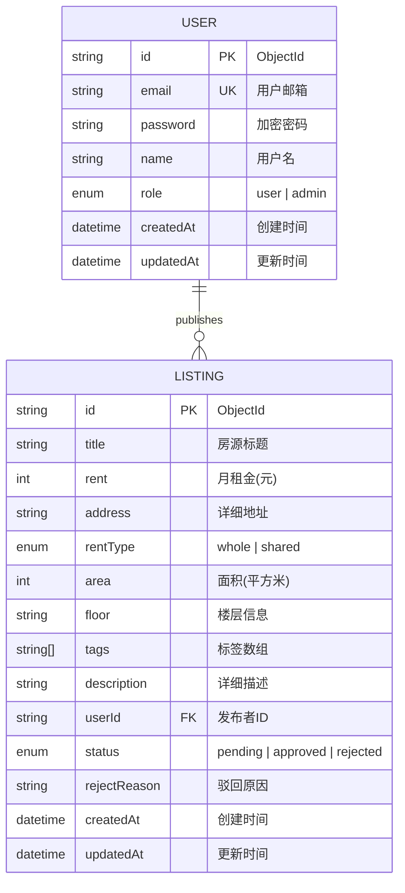
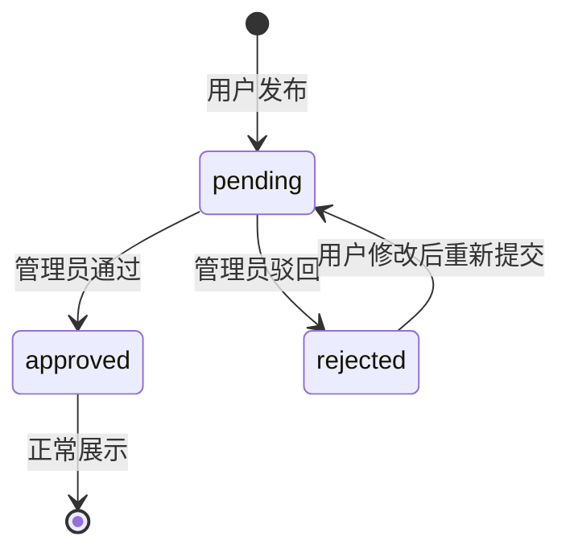

# 租房信息发布与查询平台 - 项目设计文档

## 1. 系统架构

```mermaid
flowchart TD
    subgraph Client["客户端 (Next.js App Router)"]
        A[首页 - 房源列表] --> B[登录/注册]
        A --> C[房源详情]
        B --> D[发布房源]
        B --> E[我的房源]
        B --> F[管理后台]
    end
    
    subgraph API["API Routes"]
        G[/api/auth/*] --> H[JWT认证]
        I[/api/listings/*] --> J[房源CRUD]
        K[/api/admin/*] --> L[审核管理]
    end
    
    subgraph Middleware["中间件层"]
        M[认证中间件] --> N[权限校验]
    end
    
    subgraph Database["数据层"]
        O[(MongoDB)] --> P[Prisma ORM]
    end
    
    Client --> Middleware
    Middleware --> API
    API --> Database
```

## 2. ER 图



## 3. 接口清单

### 3.1 认证模块 (/api/auth)

| 方法 | 路径 | 描述 | 权限 |
|------|------|------|------|
| POST | /api/auth/register | 用户注册 | 公开 |
| POST | /api/auth/login | 用户登录 | 公开 |
| GET | /api/auth/me | 获取当前用户信息 | 登录用户 |

### 3.2 房源模块 (/api/listings)

| 方法 | 路径 | 描述 | 权限 |
|------|------|------|------|
| GET | /api/listings | 获取已审核房源列表 | 公开 |
| GET | /api/listings/[id] | 获取房源详情 | 公开(仅审核通过) |
| POST | /api/listings | 创建房源 | 登录用户 |
| GET | /api/listings/my | 获取我的房源 | 登录用户 |
| GET | /api/listings/my/export | 导出我的投稿与审核记录资料包（含快照时间点，仅本人数据） | 登录用户 |
| PUT | /api/listings/[id] | 更新房源 | 房源所有者 |
| DELETE | /api/listings/[id] | 删除房源 | 房源所有者/管理员 |

### 3.3 管理模块 (/api/admin)

| 方法 | 路径 | 描述 | 权限 |
|------|------|------|------|
| GET | /api/admin/listings | 获取所有待审核房源 | 管理员 |
| PUT | /api/admin/listings/[id]/approve | 审核通过 | 管理员 |
| PUT | /api/admin/listings/[id]/reject | 审核驳回 | 管理员 |
| DELETE | /api/admin/listings/[id] | 删除违规房源 | 管理员 |

## 4. UI/UX 规范

### 4.1 色彩系统

| 用途 | 颜色值 | 说明 |
|------|--------|------|
| 主色调 | #3B82F6 | 蓝色，信任感 |
| 成功色 | #10B981 | 绿色，审核通过 |
| 警告色 | #F59E0B | 橙色，待审核 |
| 错误色 | #EF4444 | 红色，驳回/错误 |
| 背景色 | #F9FAFB | 浅灰背景 |
| 卡片背景 | #FFFFFF | 白色卡片 |
| 文字主色 | #111827 | 深灰文字 |
| 文字次色 | #6B7280 | 中灰文字 |

### 4.2 字体规范

- 标题字号: 24px / 20px / 18px
- 正文字号: 14px / 16px
- 辅助字号: 12px
- 字体家族: system-ui, -apple-system, sans-serif

### 4.3 间距系统

- 基础单位: 4px
- 常用间距: 8px / 12px / 16px / 24px / 32px
- 卡片圆角: 8px
- 按钮圆角: 6px

### 4.4 组件规范

- 卡片: 白色背景 + shadow-sm + 8px圆角
- 按钮: 主色背景 + 白色文字 + hover变深
- 输入框: 边框 + focus蓝色边框
- 状态标签: 圆角pill + 对应状态色背景

## 5. 目录结构

```
rental-platform/
├── app/                        # Next.js App Router
│   ├── (auth)/                 # 认证相关页面组
│   │   ├── login/
│   │   │   └── page.tsx
│   │   └── register/
│   │       └── page.tsx
│   ├── (main)/                 # 主要页面组
│   │   ├── page.tsx            # 首页-房源列表
│   │   ├── listings/
│   │   │   └── [id]/
│   │   │       └── page.tsx    # 房源详情
│   │   ├── publish/
│   │   │   └── page.tsx        # 发布房源
│   │   └── my-listings/
│   │       └── page.tsx        # 我的房源
│   ├── admin/                  # 管理后台
│   │   └── page.tsx
│   ├── api/                    # API Routes
│   │   ├── auth/
│   │   │   ├── register/
│   │   │   │   └── route.ts
│   │   │   ├── login/
│   │   │   │   └── route.ts
│   │   │   └── me/
│   │   │       └── route.ts
│   │   ├── listings/
│   │   │   ├── route.ts
│   │   │   ├── my/
│   │   │   │   └── route.ts
│   │   │   └── [id]/
│   │   │       └── route.ts
│   │   └── admin/
│   │       └── listings/
│   │           ├── route.ts
│   │           └── [id]/
│   │               ├── approve/
│   │               │   └── route.ts
│   │               ├── reject/
│   │               │   └── route.ts
│   │               └── route.ts
│   ├── layout.tsx
│   └── globals.css
├── components/                 # 组件
│   ├── ui/                     # 通用UI组件
│   │   ├── Button.tsx
│   │   ├── Input.tsx
│   │   ├── Card.tsx
│   │   ├── Badge.tsx
│   │   ├── Toast.tsx
│   │   └── Loading.tsx
│   ├── layout/                 # 布局组件
│   │   ├── Header.tsx
│   │   └── Footer.tsx
│   └── listing/                # 业务组件
│       ├── ListingCard.tsx
│       ├── ListingForm.tsx
│       └── ListingFilter.tsx
├── lib/                        # 工具库
│   ├── prisma.ts               # Prisma客户端
│   ├── auth.ts                 # JWT认证工具
│   ├── api.ts                  # API请求封装
│   └── utils.ts                # 通用工具函数
├── store/                      # Zustand状态管理
│   ├── useAuthStore.ts
│   └── useToastStore.ts
├── types/                      # TypeScript类型
│   └── index.ts
├── middleware.ts               # Next.js中间件
├── prisma/
│   └── schema.prisma           # Prisma数据模型
├── .env.example                # 环境变量示例
├── package.json
├── tailwind.config.ts
├── tsconfig.json
└── README.md
```

## 6. 状态流转



## 7. 权限矩阵

| 功能 | 游客 | 普通用户 | 管理员 |
|------|------|----------|--------|
| 浏览已审核房源 | ✅ | ✅ | ✅ |
| 注册/登录 | ✅ | - | - |
| 发布房源 | ❌ | ✅ | ✅ |
| 查看自己的房源 | ❌ | ✅ | ✅ |
| 编辑自己的房源 | ❌ | ✅ | ✅ |
| 删除自己的房源 | ❌ | ✅ | ✅ |
| 审核房源 | ❌ | ❌ | ✅ |
| 删除任意房源 | ❌ | ❌ | ✅ |
